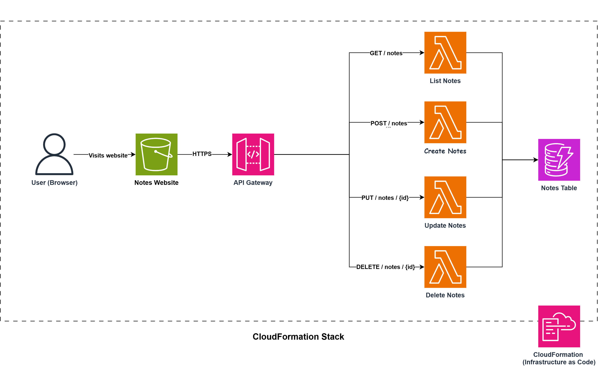
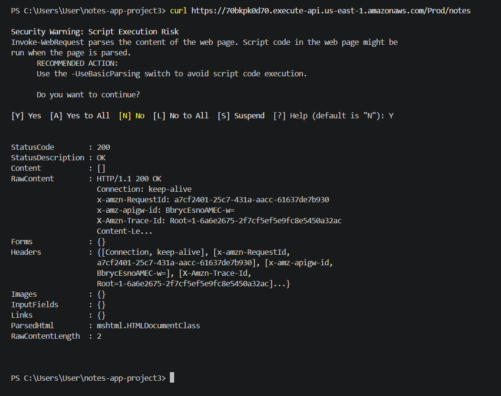
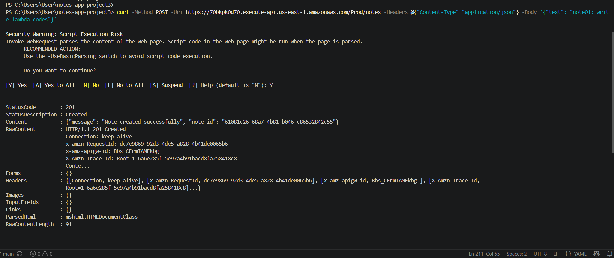
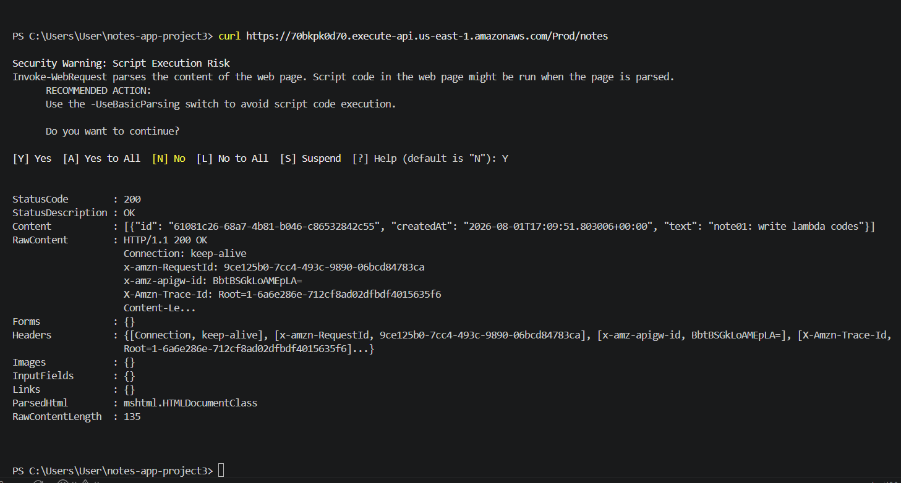
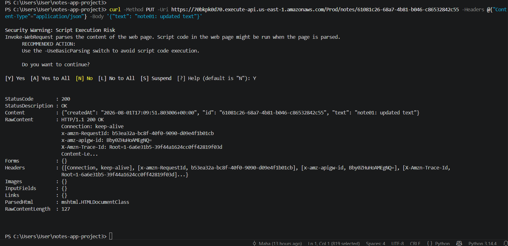
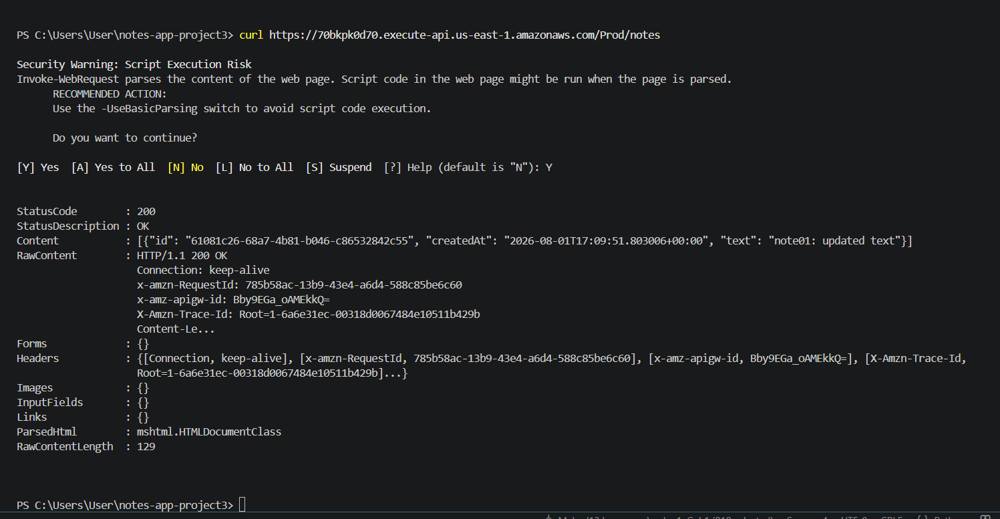
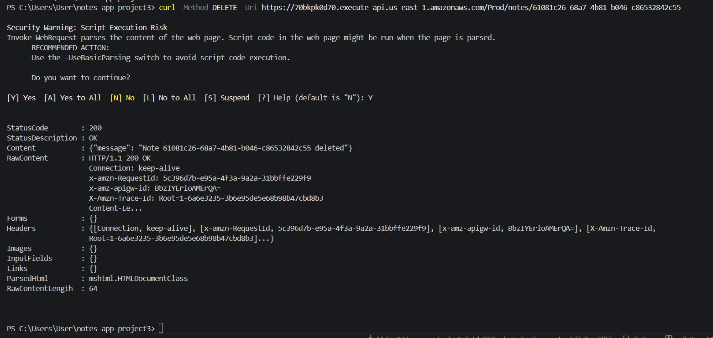
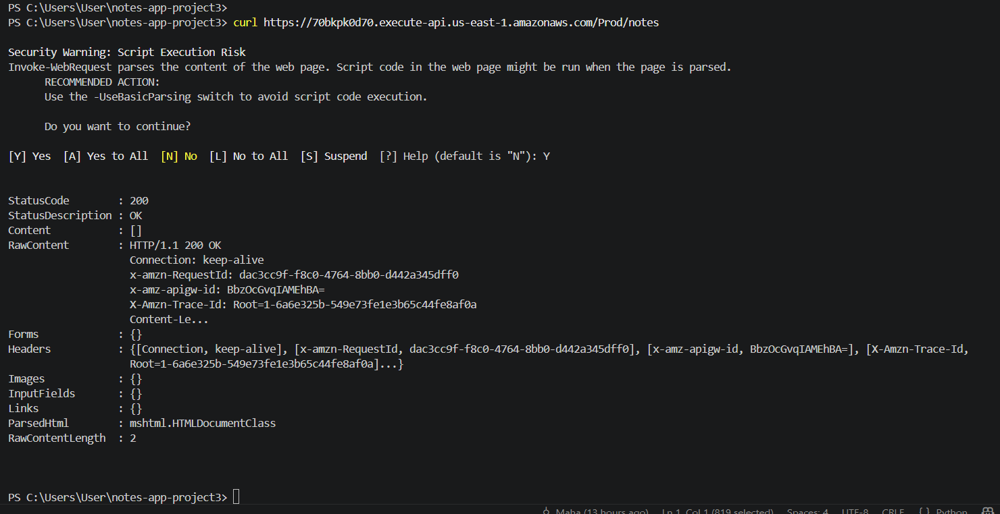

# Notes REST API with a Static Web Front End

A full CRUD notes application built entirely with serverless AWS services.
Users can create, view, update, and delete notes through a simple web interface,
backed by a REST API and a NoSQL database,
with the entire infrastructure defined and deployed through a single CloudFormation template.

**Course:** Cloud Solution Architecture - CCGC-5500 — Final Project (Project 3)
**Team:** IATIDEL AKIK & MAHA AL TUHFI

## What it does

- Create a note
- List all notes
- Get a single note by ID
- Update a note's text
- Delete a note

Each note is stored with three fields:

| Field | Description |
|---|---|
| `id` | Unique identifier, generated server-side |
| `text` | The note's content |
| `createdAt` | UTC timestamp, set when the note is created |

## Tech stack

| Service | Role |
|---|---|
| **Amazon S3** | Hosts the static front end (HTML, CSS, JavaScript) |
| **Amazon API Gateway** | REST API — routes requests to Lambda by path and method |
| **AWS Lambda** (Python 3.13) | 4 functions handle all 5 routes |
| **Amazon DynamoDB** | On-demand NoSQL table storing notes |
| **AWS CloudFormation + SAM** | Defines and deploys the entire stack as code |
| **Amazon S3** (separate bucket) | Stores zipped Lambda code, created outside CloudFormation |

## Architecture



### How a request flows through the system

**Step 1 — The browser loads the website**
The user opens the website URL, which points to an S3 bucket configured for static website hosting. 
S3 just serves the HTML, CSS, and JavaScript files.
It has no logic of its own, it's simply storage that can be reached over HTTP.

**Step 2 — The browser calls the API**
When the user does something — like clicking "Add Note" — the JavaScript in the browser sends an HTTPS request to API Gateway.
This is the only "connection" between the front end and the back end: a URL, hardcoded into the JavaScript, that was copied from the API's Outputs after deployment.

**Step 3 — API Gateway routes the request**
API Gateway acts like a receptionist reading a routing sheet. It looks at two things: the **path** (e.g. `/notes` or `/notes/{id}`) and the **method** (GET, POST, PUT, DELETE). Based on that combination, it forwards the request to the correct Lambda function. API Gateway itself contains no business logic — it only routes.

**Step 4 — The Lambda function runs**
The matching Lambda function executes. Each function is single-purpose:
- **Create Notes** — parses the note text from the request body, generates a unique ID and timestamp, and saves the item.
- **List / Get Notes** — checks whether the request included a specific note ID. If it did, it fetches just that one note. If not, it returns every note.
- **Update Notes** — checks the note exists, then updates its text field.
- **Delete Notes** — checks the note exists, then removes it.

Every function talks to DynamoDB using the same table name, passed in through an environment variable set by CloudFormation.

**Step 5 — DynamoDB stores or retrieves the data**
DynamoDB acts like a filing cabinet: every note is a single item, identified by its `id`. Lambda reads from or writes to this table directly using the AWS SDK (boto3).

**Step 6 — The response flows back**
The Lambda function returns a JSON response with a status code (e.g. `200`, `201`, `404`) and, importantly, a CORS header (`Access-Control-Allow-Origin: *`) on every response — success or error. This header has to be added manually by each Lambda, because API Gateway's proxy integration does not add it automatically. Without it, the browser would block the response entirely, even if the request itself succeeded.

The response travels back through API Gateway to the browser, where the JavaScript updates the page — for example, adding the new note to the list.

### Where the Lambda code actually comes from

CloudFormation cannot upload files directly from a computer — it can only reference resources that already exist in AWS. So before deploying, each Lambda function's code is zipped and uploaded to a separate S3 bucket, created manually, outside the CloudFormation stack. The template then references this bucket (`CodeUri: s3://...`) so Lambda knows where to pull its code from during deployment. Because this bucket is not managed by CloudFormation, deleting the stack does not delete the code — it stays ready for the next deployment.

## Inside the CloudFormation template

Everything in this project — the website bucket, the API, all four Lambda functions, and the database — is defined in a single file, `template.yaml`, using AWS SAM (Serverless Application Model) shorthand on top of CloudFormation.

### Parameters

```yaml
Parameters:
  StageName:
    Type: String
    Default: Prod
    Description: API Gateway deployment stage name
```

A single input parameter, letting the API Gateway deployment stage (e.g. `Prod`) be set without hardcoding it elsewhere in the template.

### Resources — compute & data

- **`NotesTable`** — a DynamoDB table, using on-demand billing (`PAY_PER_REQUEST`), with `id` as the partition key.
- **Four Lambda functions** — `CreateNoteFunction`, `ListNotesFunction`, `UpdateNoteFunction`, `DeleteNoteFunction` — each pointing to its zipped code in S3 via `CodeUri`, and each using the same IAM role.
- **Log groups and invoke permissions** for each function, so API Gateway is allowed to trigger them and their logs are retained.

**IAM note:** every Lambda function references a pre-built role, `LabRole`, instead of a custom IAM role. This project runs on AWS Academy Learner Lab, which does not allow students to create new IAM roles — so all functions share this one pre-provisioned role.

### Resources — API

`NotesApi` is an `AWS::Serverless::Api` resource. Its routes are defined manually inside `DefinitionBody`, rather than using SAM's simpler `Events:` shorthand — this was necessary to avoid a circular dependency issue encountered during development. Each route maps a path and method directly to a Lambda function's ARN using `aws_proxy` integration:

```yaml
paths:
  /notes:
    get:   → ListNotesFunction
    post:  → CreateNoteFunction
  /notes/{id}:
    get:    → ListNotesFunction   (handles single-note lookup)
    put:    → UpdateNoteFunction
    delete: → DeleteNoteFunction
```

CORS is configured using SAM's built-in `Cors:` property on the API resource.

### Resources — front end

- **`NotesWebsiteBucket`** — an S3 bucket with static website hosting enabled.
- **`NotesWebsiteBucketPolicy`** — a bucket policy allowing public `s3:GetObject`, so visitors can actually load the site.

### Outputs

```yaml
Outputs:
  WebsiteURL:
    Value: !GetAtt NotesWebsiteBucket.WebsiteURL
  ApiUrl:
    Value: !Sub https://${NotesApi}.execute-api.${AWS::Region}.amazonaws.com/${StageName}
```

These are printed automatically after every deployment, so the website URL and API URL never have to be tracked down manually through the console.

## API routes

Five routes are exposed across four Lambda functions — `List / Get Notes` handles two routes on its own.

| Method | Path | Function | Success | Error cases |
|---|---|---|---|---|
| `POST` | `/notes` | Create Notes | `201 Created` | `500` on failure |
| `GET` | `/notes` | List / Get Notes | `200 OK`, array of notes | `500` on failure |
| `GET` | `/notes/{id}` | List / Get Notes | `200 OK`, single note | `404` if not found |
| `PUT` | `/notes/{id}` | Update Notes | `200 OK`, updated note | `400` empty text · `404` not found |
| `DELETE` | `/notes/{id}` | Delete Notes | `200 OK`, confirmation | `404` if not found |

### Why one function handles two routes

`List / Get Notes` checks `event['pathParameters']` on every call:

```python
if path_params and path_params.get('id'):
    # a specific note was requested — fetch and return just that one
    ...
else:
    # no id — return every note (original List behavior)
    ...
```

If a note `id` is present in the path, it fetches and returns that single note (or a `404` if it doesn't exist). If not, it scans and returns every note in the table. This avoided writing a fifth, near-duplicate Lambda function just to handle single-note lookups.

### Example responses

**`POST /notes`** with body `{"text": "note1"}`:
```json
{ "message": "Note created successfully", "note_id": "61081c26-..." }
```

**`GET /notes/{id}`**:
```json
{ "id": "61081c26-...", "text": "note1", "createdAt": "2026-08-01T17:09:51.803006+00:00" }
```

**`PUT /notes/{id}`** with body `{"text": "updated text"}`:
```json
{ "id": "61081c26-...", "text": "updated text", "createdAt": "2026-08-01T17:09:51.803006+00:00" }
```

**`DELETE /notes/{id}`**:
```json
{ "message": "Note 61081c26-... deleted" }
```

## How to deploy this project

This project was built and deployed using the AWS Management Console.

### Prerequisites

- An AWS account (this project was built and tested on AWS Academy Learner Lab)
- A pre-existing S3 bucket to hold the zipped Lambda code (see Step 1)

**Note on IAM:** this project references a pre-built role, `LabRole`, in `template.yaml`. If deploying outside AWS Academy Learner Lab, replace the `Role:` line in each Lambda function with an IAM role ARN you have permission to use.

### Step 1 — Create a bucket for the Lambda code

In the S3 console, create a new bucket (e.g. `notes-app-lambda-zipfiles`). This bucket is created manually and is **not** part of the CloudFormation stack — this keeps the Lambda code safe even if the stack is deleted and redeployed.

### Step 2 — Package each Lambda function

For each function (`create-note`, `list-notes`, `update-note`, `delete-note`), zip just the `app.py` file — it must sit at the **root** of the zip, not inside a subfolder. On Windows, right-click `app.py` → **Send to → Compressed (zipped) folder**, and make sure the resulting zip contains `app.py` directly, not a nested folder.

Upload each zip to the S3 bucket from Step 1, using the exact filenames referenced in `template.yaml` (e.g. `create-note.zip`, `list-notes.zip`, `update-note.zip`, `delete-note.zip`).

### Step 3 — Deploy the CloudFormation stack

1. Go to the **CloudFormation** console → **Create stack** → **With new resources (standard)**
2. Choose **Upload a template file**, and select `template.yaml`
3. Enter a stack name (e.g. `notes-app-stack`)
4. Leave `StageName` as the default (`Prod`), or change it if needed
5. Click through the remaining steps and **Submit**

CloudFormation will create the DynamoDB table, all four Lambda functions, API Gateway, and the S3 website bucket. This takes a few minutes — watch the **Events** tab for progress.

### Step 4 — Get the Outputs

Once the stack status shows `CREATE_COMPLETE`, go to the stack's **Outputs** tab. You'll see two values:

- `WebsiteURL` — where the site will be hosted
- `ApiUrl` — the base URL of the deployed API

### Step 5 — Connect the front end to the API

Open `frontend/script.js` and paste the `ApiUrl` value into the `API_URL` constant at the top of the file:

```javascript
const API_URL = "https://your-api-id.execute-api.us-east-1.amazonaws.com/Prod";
```

### Step 6 — Upload the front end to S3

Go to the **website bucket** created by the stack (its name is visible in the stack's **Resources** tab, or in the `WebsiteURL` output). Upload `frontend/index.html` and `frontend/script.js` directly into the bucket root.

### Step 7 — Test it

Visit the `WebsiteURL` from Step 4 in a browser. You should be able to create, list, get, update, and delete notes.

> **Important:** every time `template.yaml`'s `DefinitionBody` changes and the stack is redeployed, API Gateway generates a **new invoke URL**. Always re-check the Outputs tab after any redeploy, and repeat Step 5 if the `ApiUrl` has changed.

### Cleaning up

To avoid ongoing costs, delete the stack when you're done testing:

1. **Empty the website bucket first** — CloudFormation cannot delete an S3 bucket that still contains files.
2. Go to the CloudFormation console → select the stack → **Delete**.

This removes the DynamoDB table, all four Lambda functions, API Gateway, and the website bucket. The Lambda zip bucket (from Step 1) is **not** deleted, since it exists outside the stack.

## Testing

Every route was tested two ways: directly with `curl` (proving the API works independent of any front end), and live in the browser with developer tools open (proving the full flow, including CORS).

### curl tests

All routes were tested in sequence, starting from an empty table: List (empty) → Create → List → Update → List → Delete → List, confirming the full lifecycle end to end.

**0. List notes — starting point, table is empty**



Response: `200 OK`, empty array — confirms the table starts with no data.

**1. Create a note — `POST /notes`**



Response: `201 Created`, returns the new note's ID.

**2. List all notes — `GET /notes`**



Response: `200 OK`, the new note appears in the array — confirming it was actually saved to the database.

**3. Update the note — `PUT /notes/{id}`**



Response: `200 OK`, returns the updated note.

**4. List again — confirms the text changed**



Response: `200 OK`, the note's `text` field now reflects the update.

**5. Delete the note — `DELETE /notes/{id}`**



Response: `200 OK`, confirmation message with the note's ID.

**6. List once more — confirms the note is gone**



Response: `200 OK`, empty array — deletion confirmed at the database level.

### Browser testing

With developer tools open (Console tab), every action — Create, Get single note, Update, Delete — was performed live through the website:

- No CORS errors appeared in the console at any point
- Each action's result was cross-checked directly in the DynamoDB console to confirm the change was actually persisted, not just displayed in the browser

## Challenges we faced

### CORS wasn't automatic

API Gateway's `aws_proxy` integration does not add CORS headers automatically. Every Lambda function has to return `Access-Control-Allow-Origin: *` itself, in every response — both success and error paths. Missing this on even one response path (e.g. an error case) is enough to cause a CORS failure in the browser, even though the request technically succeeded server-side.

### A missing route, caught late

While cross-checking our architecture diagram against the actual assignment specification, we discovered that a route for fetching a single note by ID had never been built — only the full List route existed. Rather than writing a fifth, near-duplicate Lambda function, we extended `List Notes` to check for a path parameter: if an `id` is present, it returns just that one note (or a `404`); if not, it falls back to returning every note.

### Account ID mismatch during a teammate merge

This project was built on AWS Academy Learner Lab, where account IDs and the `LabRole` ARN can differ between sessions — even for the same student. When merging a teammate's version of `template.yaml`, the `Role:` ARNs referenced a different account ID than the one actually in use, which caused every deployment to fail until the mismatch was caught and corrected.

### Lambda zip packaging

`app.py` has to sit at the **root** of the zip file, not nested inside a subfolder. Zipping the entire project folder instead of just the file caused an `Unable to import module 'app'` error the first time — an easy mistake to make when using "Compress to zip" on a whole directory instead of the file itself.

### API Gateway invoke URL changes on redeploy

Whenever `template.yaml`'s `DefinitionBody` (the API routes) changes, or the stack is deleted and redeployed, API Gateway generates a **new invoke URL**. This means `script.js`'s `API_URL` constant has to be manually updated and re-uploaded to S3 after every such redeploy — otherwise the front end silently points at a stale or non-existent API, resulting in `net::ERR_NAME_NOT_RESOLVED` errors in the browser.

## Stretch feature — Get a single note by ID

Beyond the base requirement of listing all notes, we built a dedicated single-note lookup interface. A user can paste a note's ID into a separate input field, click **Get Note**, and see that note's text, ID, and creation timestamp rendered in its own result card — without affecting or filtering the main "All Notes" list.

This is backed by the exact same `GET /notes/{id}` route that `List Notes` exposes (see [API routes](#api-routes)) — no new backend logic was required, just a new front-end interaction built on top of the existing route.

Verified two ways:
- Directly via `curl` (see [Testing](#testing))
- Live in the browser, confirming no CORS errors and correct rendering of the returned note